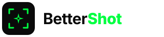
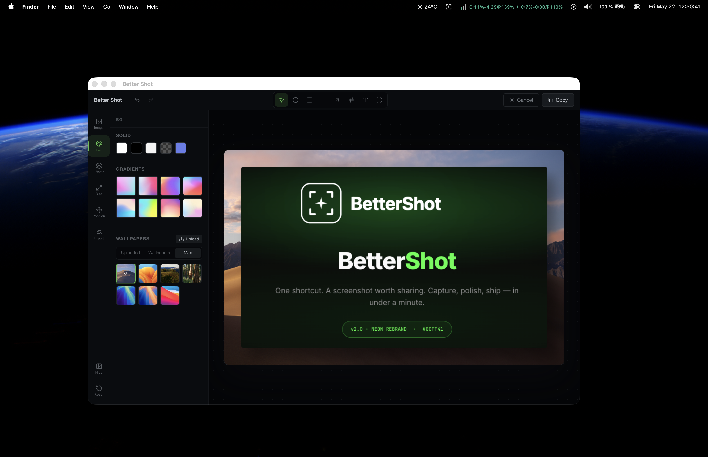
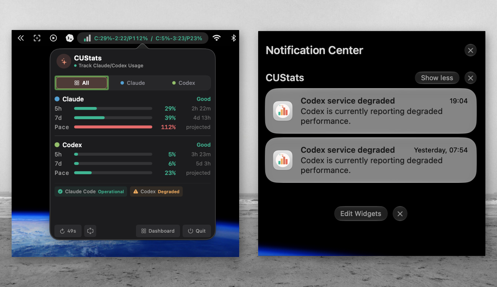
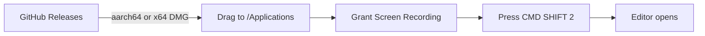
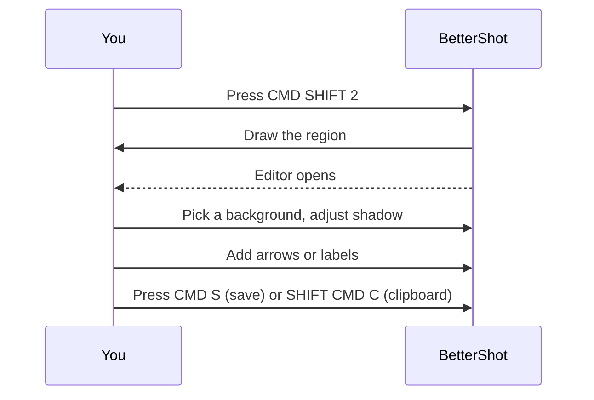

<p align="center">
  
</p>

<p align="center">
  <a href="https://github.com/luongnv89/better-shot/releases"></a>
  <a href="https://github.com/luongnv89/better-shot/releases"></a>
  <a href="https://github.com/luongnv89/better-shot/releases"></a>
  <a href="./LICENSE"></a>
  <a href="https://github.com/luongnv89/better-shot/stargazers"></a>
</p>

# One shortcut. A screenshot worth sharing.

Capture, polish, and ship a screenshot in under a minute. Native macOS, fully local, no account.



[**Download for macOS &rarr;**](#install)

---

## Key features

| | What it does |
|---|---|
| **Region, screen, window capture** | Three capture modes, each with its own global shortcut |
| **Backgrounds** | Wallpapers, mesh gradients, solid colors, transparent, or your own image |
| **Shadow + corner radius** | Tune depth and edges to match the look you want |
| **Border + padding** | Edge-to-edge or up to 200px breathing room |
| **Blur + noise textures** | Subtle film-grain backgrounds without leaving the app |
| **Annotations** | Arrows, circles, rectangles, lines, text, numbered callouts |
| **Device frames** | Wrap captures in iPhone or MacBook frames |
| **Side-by-side comparison** | Place two photos in one frame with an adjustable split and swap |
| **Upload to edit** | Drop any PNG or JPG in and apply the same toolkit |
| **Undo / redo history** | Nothing is permanent until you save or copy |
| **100% local** | No network calls, no telemetry, no account, no upload |



---

## Install



Pre-built **DMGs are signed and notarized by Apple** &mdash; no "unidentified developer" warning on first launch.

### Option 1: Direct download

Open the [latest release](https://github.com/luongnv89/better-shot/releases/latest) and grab the DMG that matches your Mac:

| Chip | File |
|---|---|
| Apple Silicon (M1 &ndash; M5) | `bettershot_<version>_aarch64.dmg` |
| Intel | `bettershot_<version>_x64.dmg` |

Not sure which? On your Mac: **Apple menu &rarr; About This Mac**. If the chip name starts with "Apple", pick Apple Silicon.

### Option 2: One-line install (shell)

Pulls the latest tag and the matching DMG into `~/Downloads`:

```bash
TAG=$(curl -s https://api.github.com/repos/luongnv89/better-shot/releases/latest | sed -n 's/.*"tag_name": "\(.*\)",/\1/p') ; ARCH=$([ "$(uname -m)" = arm64 ] && echo aarch64 || echo x64) ; curl -L -o ~/Downloads/bettershot.dmg "https://github.com/luongnv89/better-shot/releases/download/${TAG}/bettershot_${TAG#v}_${ARCH}.dmg"
```

### Option 3: Homebrew

```bash
brew install --cask bettershot
```

### After install

1. Open the DMG and drag **BetterShot** into Applications.
2. Launch it once. macOS will ask for **Screen Recording** &mdash; grant it in **System Settings &rarr; Privacy & Security &rarr; Screen Recording**.
3. Restart BetterShot once after granting the permission.

### Verify the notarization (optional)

```bash
spctl --assess -vv /Applications/bettershot.app
```

Expected output:

```
/Applications/bettershot.app: accepted
source=Notarized Developer ID
origin=Developer ID Application: Luong NGUYEN (6W9K2M3768)
```

**Requirements:** macOS 10.15 (Catalina) or later. Apple Silicon and Intel both supported.

---

## How to use

### Capture

| Action | Shortcut |
|---|---|
| Capture a region | `CMD SHIFT 2` |
| Capture full screen | `CMD SHIFT F` (enable in Preferences) |
| Capture a window | `CMD SHIFT D` (enable in Preferences) |
| Bring BetterShot to front | `CMD SHIFT B` |
| Cancel a capture | `Esc` |

Shortcuts work from anywhere on macOS, even when BetterShot is hidden in the menu bar.

### Edit

The editor opens immediately after every capture. Workflow:



### Editor shortcuts

| Action | Shortcut |
|---|---|
| Save to disk | `CMD S` |
| Copy to clipboard | `SHIFT CMD C` |
| Undo | `CMD Z` |
| Redo | `SHIFT CMD Z` |
| Delete selected annotation | `Delete` or `Backspace` |
| Close editor | `Esc` |

---

## Privacy

Everything runs on your Mac. No uploads, no account, no telemetry, no network calls from the capture or editor paths. The only network use is checking for updates &mdash; opt-in, off by default.

---

## Roadmap & changelog

Releases are tagged in semver. See [CHANGELOG.md](./CHANGELOG.md) for the full history, or the [latest release](https://github.com/luongnv89/better-shot/releases/latest) for what's new in the current build.

---

<details>
<summary><b>Build from source</b></summary>

**Requirements:** Node.js 18+, pnpm, Rust (latest stable), Xcode Command Line Tools.

```bash
git clone https://github.com/luongnv89/better-shot.git
```

```bash
cd better-shot && pnpm install
```

```bash
pnpm tauri build
```

The unsigned `.app` and `.dmg` land in `src-tauri/target/release/bundle/`. Signed and notarized DMGs require an Apple Developer ID Application certificate in the login keychain and an App Store Connect API key &mdash; the maintainer builds these locally and uploads them to the GitHub release.

</details>

<details>
<summary><b>Development</b></summary>

```bash
pnpm tauri dev
```

```bash
pnpm lint:ci
```

```bash
pnpm test
```

```bash
pnpm test:rust
```

</details>

<details>
<summary><b>Architecture</b></summary>

- **Frontend:** React 19 + TypeScript + Tailwind CSS 4, bundled by Vite
- **State:** Zustand store with persistent settings via `tauri-plugin-store`
- **Backend:** Rust (Tauri 2) with custom commands for screenshot capture, file dialogs, and temp-workspace lifecycle
- **Capture:** macOS native APIs via `tauri-plugin-screenshots`
- **Global hotkeys:** `tauri-plugin-global-shortcut`
- **Bundle:** Code-signed and notarized DMGs for `aarch64-apple-darwin` and `x86_64-apple-darwin`

</details>

<details>
<summary><b>Contributing</b></summary>

Contributions are welcome. Read [CONTRIBUTING.md](./CONTRIBUTING.md) before submitting a pull request. Bug reports and feature requests via [GitHub issues](https://github.com/luongnv89/better-shot/issues).

</details>

<details>
<summary><b>Star history</b></summary>

<a href="https://www.star-history.com/#luongnv89/better-shot&type=date&legend=top-left">
 <picture>
   <source media="(prefers-color-scheme: dark)" srcset="https://api.star-history.com/svg?repos=luongnv89/better-shot&type=date&theme=dark&legend=top-left" />
   <source media="(prefers-color-scheme: light)" srcset="https://api.star-history.com/svg?repos=luongnv89/better-shot&type=date&legend=top-left" />
   
 </picture>
</a>

</details>

---

**[Download &rarr;](#install) &middot; [Changelog](./CHANGELOG.md) &middot; [Open an issue](https://github.com/luongnv89/better-shot/issues) &middot; BSD-3 Licensed**
