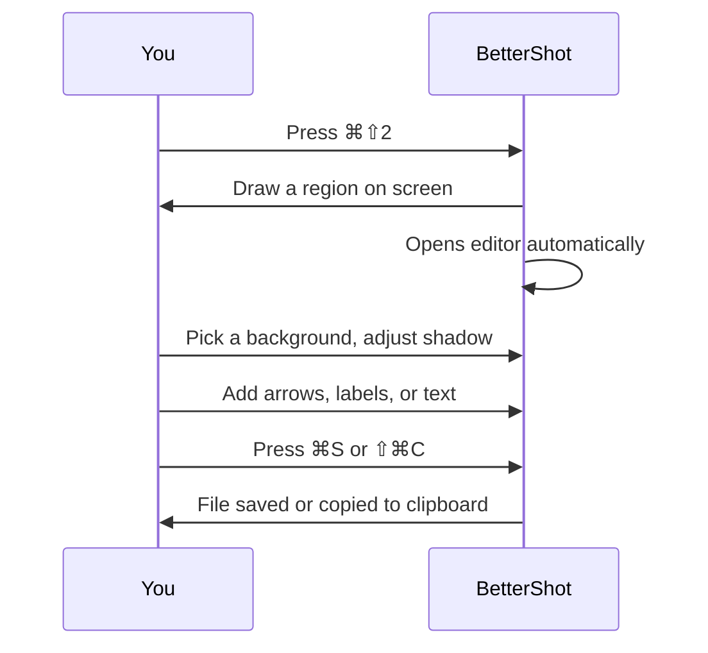

<p align="center">
  
</p>

<p align="center">
  <a href="https://github.com/luongnv89/better-shot/releases"></a>
  <a href="https://github.com/luongnv89/better-shot/releases"></a>
  <a href="./LICENSE"></a>
  <a href="https://github.com/luongnv89/better-shot/stargazers"></a>
</p>

# One shortcut. A screenshot worth sharing.

BetterShot captures your screen and opens it in an editor — add a background, shadow, and annotations before you share. Free, local, no account required.


[**Download for macOS →**](#download)

---

## Before and after

Without BetterShot, you paste a raw screenshot into a message or doc — sharp edges, white background, no context.

With BetterShot, the same capture gets a polished background, soft shadow, and optional callout arrows in under a minute.

---

## How it works



One shortcut triggers everything. The editor opens immediately — no extra clicks, no switching apps.

---

## What you can do in the editor

| | What it does |
|---|---|
| **Backgrounds** | Wallpapers, mesh gradients, solid colors, transparent — pick one or use your own |
| **Shadow + depth** | Adjust shadow size and corner radius to match your style |
| **Border control** | Set padding from 0 (edge-to-edge) to 200px |
| **Blur + noise** | Subtle texture effects on the background |
| **Arrows and shapes** | Draw circles, rectangles, lines, arrows directly on the screenshot |
| **Text labels** | Add text at any size and color |
| **Numbered callouts** | Auto-incrementing badges for step-by-step walkthroughs |
| **Undo / redo** | Full history — nothing is permanent until you export |
| **Upload a photo** | Edit any existing image, not just fresh captures |

---

## Keyboard shortcuts

### Capturing

| What | Shortcut |
|---|---|
| Capture a region | `⌘⇧2` (always on) |
| Capture full screen | `⌘⇧F` (enable in Preferences) |
| Capture a window | `⌘⇧D` (enable in Preferences) |
| Cancel | `Esc` |

Shortcuts work from anywhere — even when BetterShot is hidden in the menu bar.

### In the editor

| What | Shortcut |
|---|---|
| Save | `⌘S` |
| Copy to clipboard | `⇧⌘C` |
| Undo | `⌘Z` |
| Redo | `⇧⌘Z` |
| Delete selected annotation | `Delete` or `Backspace` |
| Close editor | `Esc` |

---

## Download

**Homebrew:**

```bash
brew install --cask bettershot
```

**Direct download:**

Go to [Releases](https://github.com/luongnv89/better-shot/releases) and pick:
- **Apple Silicon** (M1/M2/M3/M4/M5): `bettershot_*_aarch64.dmg`
- **Intel Mac**: `bettershot_*_x64.dmg`

Open the DMG, drag BetterShot to Applications, and launch it.

**First launch:** macOS will ask for Screen Recording permission. Go to System Settings → Privacy & Security → Screen Recording and enable BetterShot. Restart the app once.

**Requirements:** macOS 10.15 or later.

---

## Privacy

Everything runs on your Mac. No uploads, no account, no telemetry. Screenshots stay on your machine.

---

<details>
<summary>Build from source</summary>

**Requirements:** Node.js 18+, pnpm, Rust (latest stable)

```bash
git clone https://github.com/luongnv89/better-shot.git
cd better-shot
```

```bash
pnpm install
```

```bash
pnpm tauri build
```

The installer lands in `src-tauri/target/release/bundle/`.

</details>

<details>
<summary>Development</summary>

```bash
pnpm tauri dev
```

```bash
pnpm lint:ci
pnpm test:rust
```

</details>

<details>
<summary>Contributing</summary>

Contributions are welcome. Read [CONTRIBUTING.md](CONTRIBUTING.md) before submitting a pull request.

</details>

<details>
<summary>Star history</summary>

<a href="https://www.star-history.com/#luongnv89/better-shot&type=date&legend=top-left">
 <picture>
   <source media="(prefers-color-scheme: dark)" srcset="https://api.star-history.com/svg?repos=luongnv89/better-shot&type=date&theme=dark&legend=top-left" />
   <source media="(prefers-color-scheme: light)" srcset="https://api.star-history.com/svg?repos=luongnv89/better-shot&type=date&legend=top-left" />
   
 </picture>
</a>

</details>

---

**[Download →](#download) · [Open an issue](https://github.com/luongnv89/better-shot/issues) · BSD-3 Licensed**
